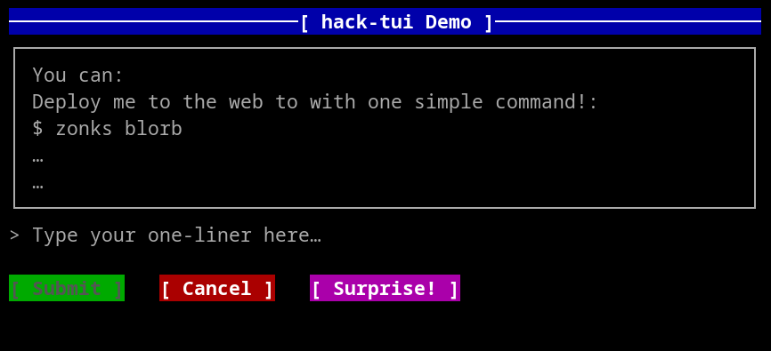
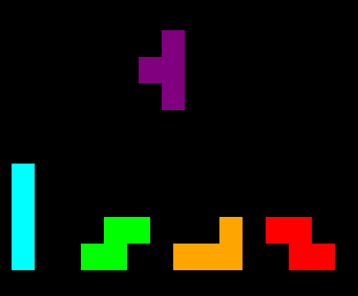
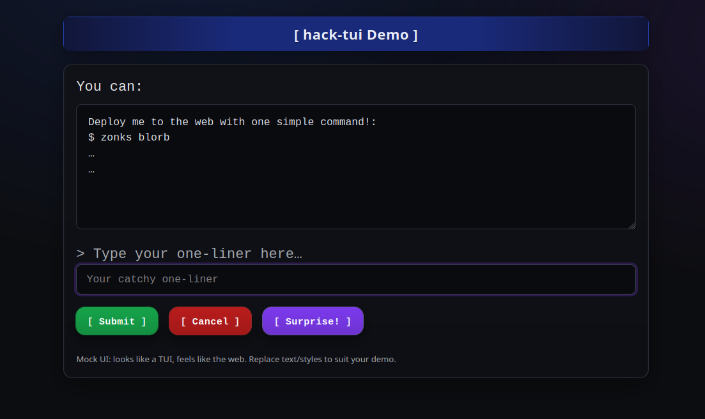

🌌 **hack-tui** (working name)
=============================

> **Declarative UIs for Rust** – build once, run in the terminal using Ratatui **and** the browser.
> Inspired by [Textual](https://github.com/Textualize/textual) for Python and React for the web.

* * *

🚀 Vision
---------
Declarative UI: 

*   terminal (tui) is a first-class citizen

*   WASM/web (browser) is a first-class citizen


“one declarative description → multiple render targets”
   

Rust has amazing TUI-only crates (`ratatui`) an GUI/web frameworks, but nothing unifies them in a **declarative, component-based model**.

**hack-tui** aims to change that:

*   Write declarative Rust code (React/SwiftUI style).
    
*   Render **identically** in the terminal (via Ratatui) and the web (via WASM).
    
*   strong declarative model
    
*   cross-platform rendering
    

* * *

✨ Example (imaginary, for now)
------------------------------


```
fn main() {
    App::new()
        .view(
            VStack::new()
                .child(Label::new("Hello, world!"))
                .child(Button::new("Click me", |ctx| {
                    ctx.log("Button clicked!");
                }))
        )
        .run();
}
```

**Terminal example (textarea, entry line, buttons):**

<p align="center"></p>

**Terminal example: (tetris game)**

<p align="center"></p>


**Browser (WASM):**

<p align="center"></p>

* * *

📍 Roadmap
----------

*    **MVP** – Terminal-only, Ratatui backend
    
*    **State management** – simple signals/hooks
    
*    **Component system** – buttons, inputs, tables
    
*    **Web backend** – WASM + DOM renderer
    
*    **Themes** – consistent styling across backends
    
*    **Ecosystem** – community-built widgets
    

* * *

🤝 Contributing
---------------

This project is in its **very early stages** – more vision than implementation.  
If you:

*   Love Rust
    
*   Love TUIs
    
*   Love the idea of **one codebase → terminal + web**
    

…then come join! Open issues, propose APIs, or hack on an MVP.

* * *

💡 Inspiration
--------------

*   [Textual (Python)](https://github.com/Textualize/textual)
    
*   [Ratatuí (Rust)](https://github.com/ratatui-org/ratatui)
    
*   React
    

* * *

📜 License
----------

MIT — free to use, hack, dream.

* * *

